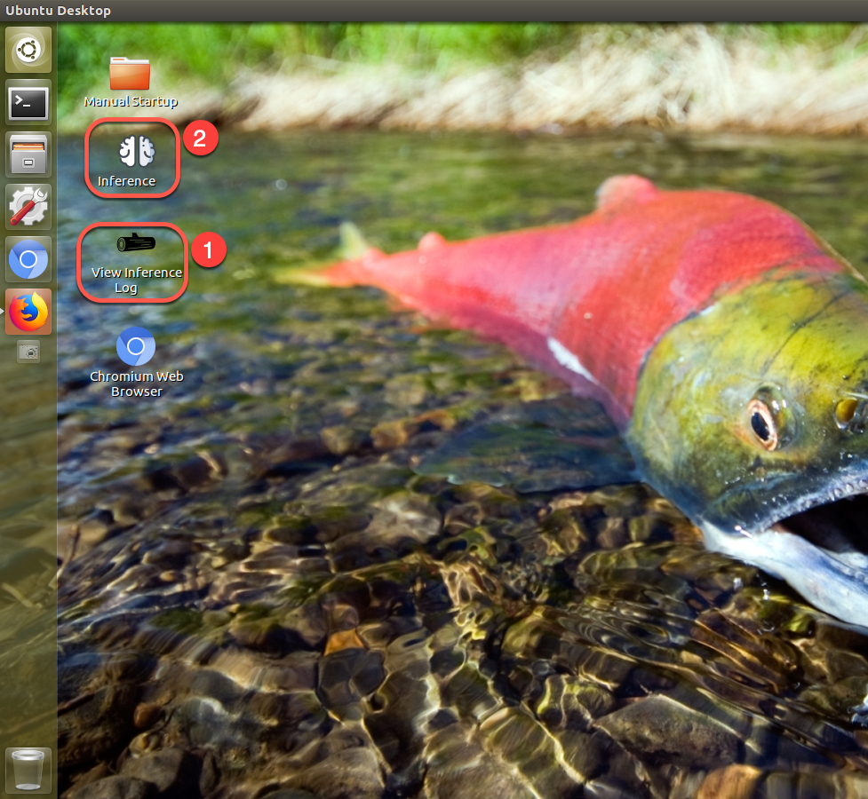
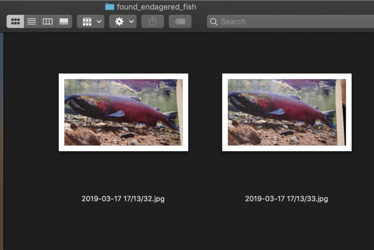

# TF_Inference

This repository contains the code needed to run inference on the Tensorflow generated frozen graph (model) along with the needed resources to build it again.

- [Overview and dependencies](#overview-and-dependencies)
- [Project Architecture](#project-architecture)
- [How to run inference](#how-to-run-inference)
- [Stop Inference](#stop-inference)
- [Results explained](#what-is-happening)
- [Troubleshooting](#troubleshooting)
- [Future improvements](#future-improvements)

## Overview and dependencies

To run properly both `snapshot.py` and `run_inference.py` must be running at the same time and through the duration of the exploration.

1. **`snapshots.py`** process uses openCV to capture an image from the main web cam at 12fps by default
2. **`run_inference.py`** ensures that the directory being used is not empty, if it is then there is a buffer of time on which the snapshot process is allowed to catch-up
3. Once the image has been read and inference run we store or or ignore the image based on the results we found.
4. Images are removed from directory to prevent wasted space

## Project architecture

[TF-hub module is mobilenet_v1_050](https://tfhub.dev/google/imagenet/mobilenet_v1_050_224/feature_vector/1)

This TF-Hub module uses the TF-Slim implementation of mobilenet_v1_050 with a depth multiplier of 0.5 and an input size of 224x224 pixels.

This is the current tree structure of the project note that `run_inference.py` must be on the parent directory of:
`/tf_files/mobile_net_fish_of_guadalupe_graph.pb` and `/tf_files/mobile_net_guadalupe_labels.txt`

~~~bash
TF_inference
|
├── README.md
├── assets
├── jetsonCV.py
├── run_inference.py
├── snapshots.py
├── tf_files
│   ├── bottlenecks
│   ├── mobile_net_fish_of_guadalupe_graph.pb
│   ├── mobile_net_guadalupe_labels.txt
│   ├── models
│   └── training_summaries
└── utils
    ├── cat_inference_processes.sh
    ├── inference.desktop
    ├── log.desktop
    ├── startup.desktop
    └── stop_inference.sh
~~~

## How to run inference

The Jetsonboard TX2 is configured to run all needed commands on boot up so no need to run them manually; however, in order to accomplish this the `.profile` and `/etc/sudoers` files were altered. There is a backup of sudoers at `/root/sudoers.bak`.

On boot up there are a few scripts that prepare the rover for an expedition; namely, all the directories needed for proper operation are created if they are missing, the Jetsonboard is set to max settings (max GPU frequency), and program to gather images is spun up.

In other words the rover is in **capture** mode and is only capturing images to store them into disk. By default the inference running task is done at the lab once the rover navigation is over.

### View resuts and run inference

When the Jetson is turned on it automatically logs into the `nvidia` user directly onto the user's Desktop. At the Desktop there are two icons that are used to run inference on the captured images:

1. Double click `View Inference Log`

> Starts a new shell showing live output of the inference program

2. Double click `Inference`

>Starts the `run_inference.py` program

There will be two need windows open that will start the program and show it's status

#### Running inference manually

You would want to do this if you're working on the model on your local computer or an AWS instance. Just create the model and feed the `run_inference.py` script your frozen graph in the form of a **.pb** file and your labels in a **.txt** file.

In order to execute the program ensure you have these Python packages installed and have sourced your virtual environment if you're using one

~~~bash
Keras-Applications==1.0.7
opencv-python==4.0.0.21
protobuf==3.7.0
tensorflow==1.13.1
tensorflow-hub==0.3.0
~~~

It is a good idea to use the 256 Cuda Cores on the Jetson at max frequency but you might not be able to if running on battery with less than 12 Volts, try anyway:

~~~bash
cd ~/Desktop

sudo ./jetson_clocks.sh
~~~

Finally run both processes to get started

~~~bash
cd ~/TF_Inference/

python snapshots.py &

# Open a new terminal
sudo python3 run_inference.py \
--graph tf_files/mobile_net_fish_of_guadalupe_graph.pb \
--labels tf_files/mobile_net_guadalupe_labels.txt
~~~

you know you did it right if this is your output:

Note that we have disabled the email function for now, it is functional but we do not have reliable wireless connectivity as of now

## Stop Inference

By default inference will run on boot of the Jetsonboard. It will run automatically because there is a script that is set to run in `/etc/rc.local` this script will create the temporary folders needed for the inference and snapshots processes to run.

Because they are running by default they will continue to run even if the Jetson is plugged into an HDMI output so to stop them run the stop script in the utilities folder of this repo:

~~~bash
sudo sh ~/TF_Inference/utils/stop_inference.sh
~~~

>Note: the command above must be sudo as **rc.local** runs as super user. Sudo password for the Jetson nvidia user is `nvidia`

If you suspect that the processes are still running or simply want to make sure they are running run the following command

~~~bash
sh ~/TF_Inference/cat_inference_processes.sh
~~~

### What is happening

As you see from the architecture diagram, inference is constantly run and when an image is of interest it is stored on disk. Take a look at the image below, it is a paper printout of a chinook salmon which was identified and stored on a new directory:

## Future improvements

New data on the target fish is desperately needed

## Troubleshooting

One of the biggest challenges when working with the Jetson is that there are several libraries and programs which will work on your desktop or laptop pc that will not work on the Jetson because of its architecture. We worked around most of them and figured out the problems; however, there is one problem that persists and is a [well known issue with JetsonBoard](https://devtalk.nvidia.com/default/topic/1029742/jetson-tx2/tensorflow-1-6-not-working-with-jetpack-3-2/2). When you run the inference script you may encounter the following error:

~~~text
E tensorflow/stream_executor/cuda/cuda_driver.cc:967] failed to alloc 1048576 bytes on host: CUDA_ERROR_UNKNOWN
2019-05-06 05:43:48.865480: W ./tensorflow/core/common_runtime/gpu/pool_allocator.h:195] could not allocate pinned host memory of size: 1048576
2019-05-06 05:43:48.865508: E tensorflow/stream_executor/cuda/cuda_driver.cc:967] failed to alloc 943872 bytes on host: CUDA_ERROR_UNKNOWN
2019-05-06 05:43:48.865532: W ./tensorflow/core/common_runtime/gpu/pool_allocator.h:195] could not allocate pinned host memory of size: 943872
2019-05-06 05:43:48.865568: E tensorflow/stream_executor/cuda/cuda_driver.cc:967] failed to alloc 849664 bytes on host: CUDA_ERROR_UNKNOWN
~~~

At first this issue occurred every time we used TensorFlow but we added these lines on the python script as a hot fix

~~~python
config = tf.ConfigProto()
config.gpu_options.allow_growth = True
~~~

but this alone did not solve the problem. Additionally you must run the inference program with **sudo** permissions, and if python3 fails use python2.7

Another problem is running out of memory while running inference to check on the status of the memory run these commands

~~~bash
cd ~/
./tegrastats.sh
~~~
